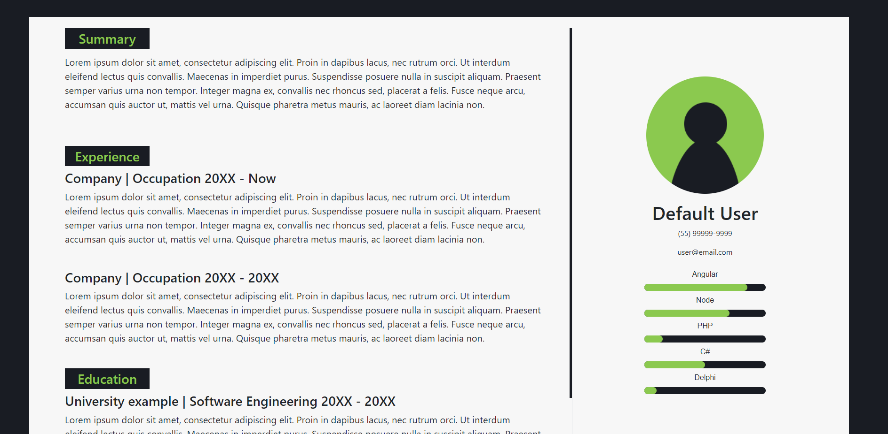
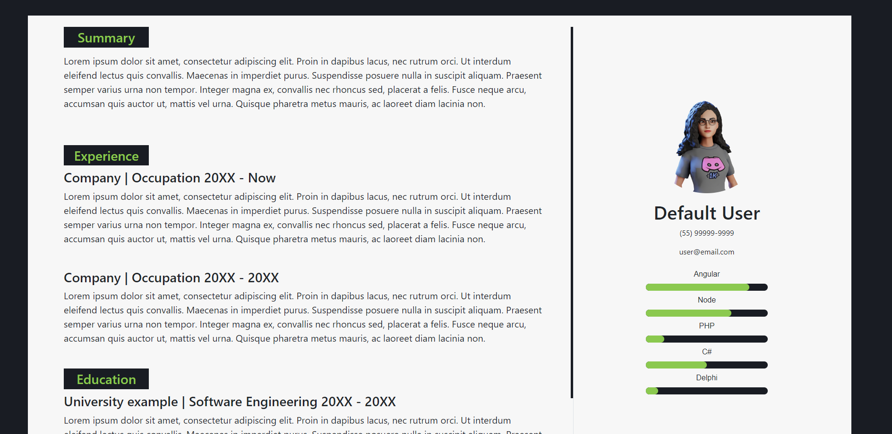
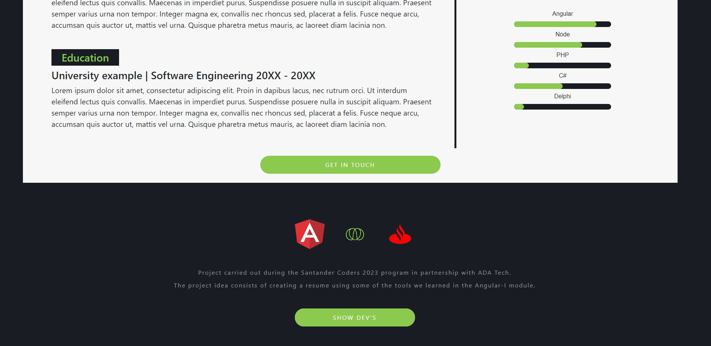
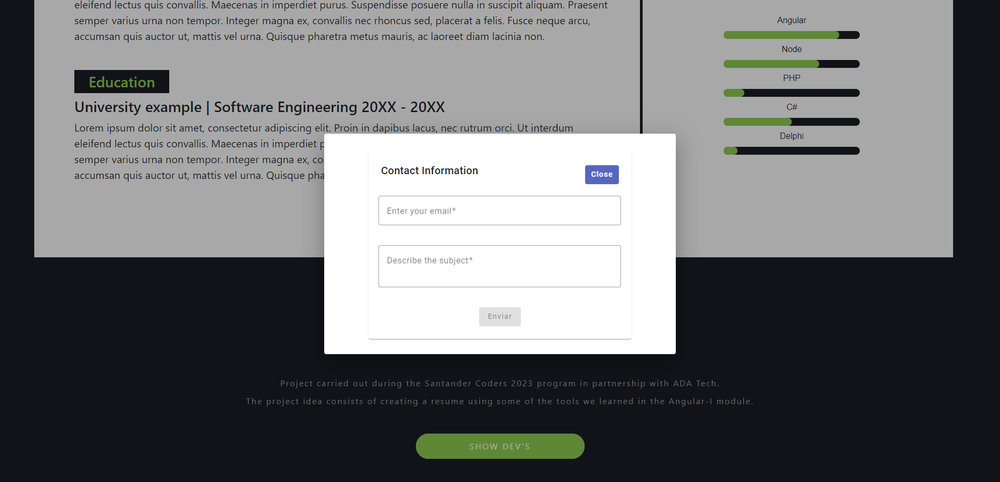
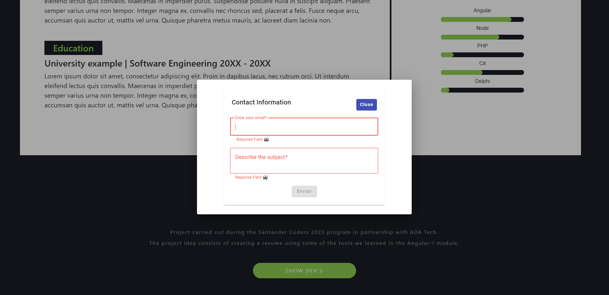
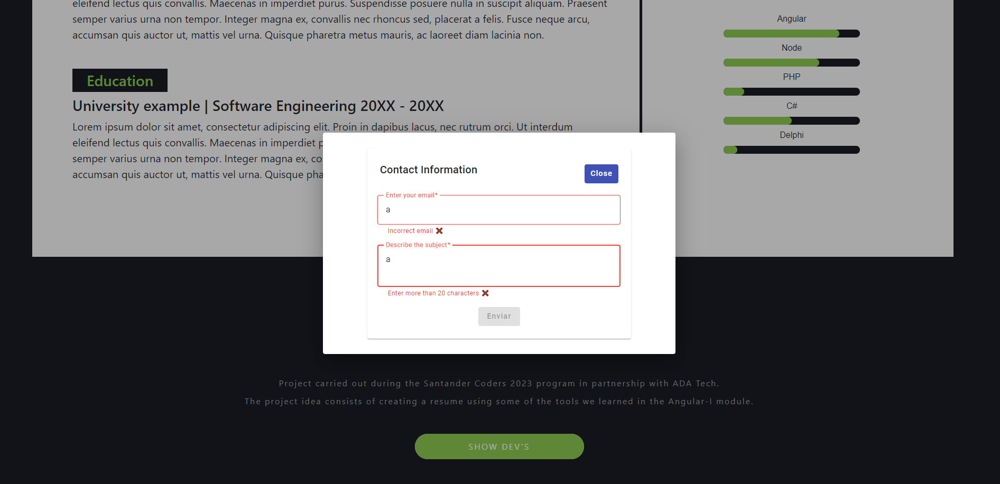
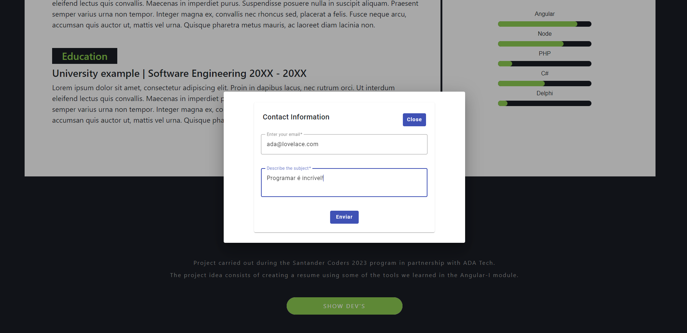
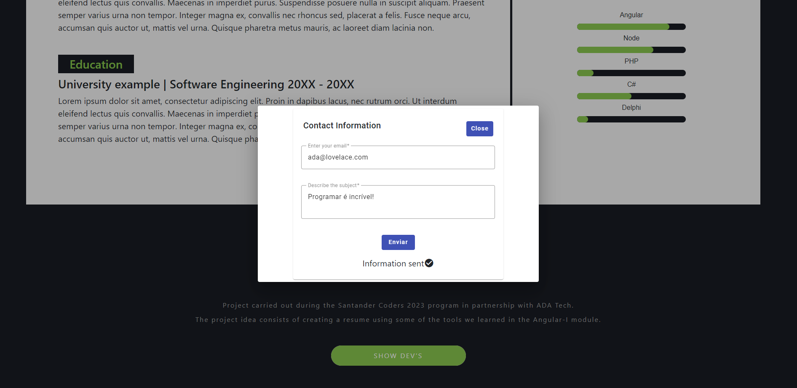
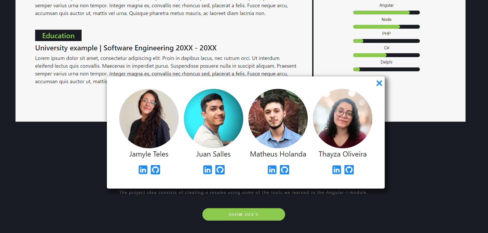

# <h1 align='center'>RESUME PROJECT </h1>

## Description 📚

This is the final project of the Angular Framework I module of the Santander Coders program. The project consists of a web application that displays the interface of a resume containing all the information of a specific candidate, including the ability to upload a photo stored on the user's machine. Additionally, there is the possibility to get in touch through a form that validates the entered data. We used HTML, SCSS, Bootstrap, Typescript, and Angular to create the interface and interactivity of the application. The concept of componentization, Input and Output, custom directive, custom pipe, and validated form were used. Project versioning was done using Git and Github, allowing each group member to contribute and track changes.

## Technologies Used 🚀

- HTML
- SCSS
- Bootstrap
- Typescript
- Angular
- Git e Github

## Main Features 🌟

- Candidate photo editing;
- Sending validated information to get in touch;
- Hover effects on interactive elements;
- Custom directives and pipes;
- Use of Input and Output;

## Installation 🔧

To run this project locally, follow these steps:

1. Clone this repository:

```bash
git clone https://github.com/DevSquad-SantanderCoders/resume-project.git
```

2. Navigate to the directory:

```bash
cd resume-project
```

3. Install the dependencies using npm:

```bash
npm install
```

## Execution ▶

To start the project, run the following command:

```bash
ng serve
```

## Preview

<div align='center' >

   <h3> Default </h3>
   
   <h3> Chosen Photo </h3>
   
   <h3> Footer </h3>
   
   <h3> Dialog Form </h3>
   
   <h3> Dialog Form - Required Validation </h3>
   
   <h3> Dialog Form - Custom Validation </h3>
   
   <h3> Dialog Form - Activation of shipment </h3>
   
   <h3> Dialog Form - Sent data</h3>
   
   <h3> Dialog Devs </h3>
   

</div>

## Authors 👩🏻‍💻👨🏻‍💻

- [Jamyle Layla](https://github.com/JamyleTeles)
- [Juan Salles](https://github.com/JuanSalles)
- [Matheus Holanda](https://github.com/MMatheus-Holanda)
- [Thayza Oliveira](https://github.com/tthayza)
